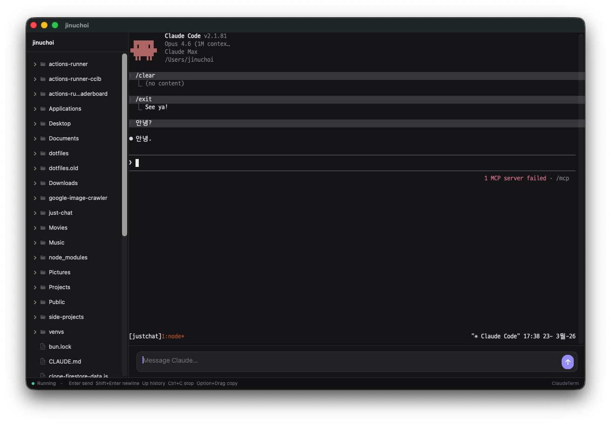

<p align="center">
  <h1 align="center">ClaudeTerm</h1>
  <p align="center">A native macOS terminal for Claude Code</p>
</p>

<p align="center">
  
  
  
</p>

<p align="center">
  <a href="docs/README.ko.md">한국어</a> | English
</p>

<p align="center">
  
</p>

> SwiftTerm terminal + native text composer. Full CJK IME support, file sidebar, tmux session persistence — all in a lightweight macOS app.

## Quick Start

```bash
brew install tmux
git clone https://github.com/jinu/ClaudeTerm.git
cd ClaudeTerm && ./scripts/build-app.sh
open dist/ClaudeTerm.app
```

Or run directly: `swift run ClaudeTerm ~/Projects/my-project`

## Features

| Feature | Description |
|---------|-------------|
| CJK IME support | Full composition via native NSTextView — Korean, Japanese, Chinese input works perfectly |
| File sidebar | Click to insert `@file` references, double-click for Quick Look preview |
| Session persistence | tmux sessions survive app restarts |
| Font matching | Automatically uses your Terminal.app or iTerm2 font |
| Input history | Up/Down arrows to recall previous messages |
| Terminal shortcuts | Ctrl+C, Escape, Tab, Option+Drag copy — all forwarded to CLI |

## Requirements

- macOS 13+
- [tmux](https://github.com/tmux/tmux) (`brew install tmux`)
- [Claude Code CLI](https://docs.anthropic.com/en/docs/claude-code) (`npm install -g @anthropic-ai/claude-code`)

## Installation

<details>
<summary><strong>Build from source (recommended)</strong></summary>

```bash
git clone https://github.com/jinu/ClaudeTerm.git
cd ClaudeTerm
./scripts/build-app.sh
cp -r dist/ClaudeTerm.app /Applications/
```

</details>

<details>
<summary><strong>Run with Swift Package Manager</strong></summary>

```bash
git clone https://github.com/jinu/ClaudeTerm.git
cd ClaudeTerm
swift run ClaudeTerm [optional-path]
```

</details>

## Usage

| Key | Action |
|-----|--------|
| Enter | Send message |
| Shift+Enter | New line |
| Up/Down | Input history |
| Ctrl+C | Interrupt |
| Option+Drag | Select & copy |
| Cmd+N | New workspace |
| Cmd+O | Open folder |

**Sidebar:** Single-click a file to insert `@filename`. Double-click to preview.

## How It Works

```
Composer (NSTextView) → Enter → PTY stdin → Claude CLI (inside tmux)
Claude CLI stdout → PTY → SwiftTerm (xterm-256color) → Screen
```

The native composer handles IME composition. Everything else goes straight through the PTY to the real CLI — no JSON parsing, no API proxy.

## Contributing

Contributions welcome. Please open an issue first to discuss what you'd like to change.

## License

MIT
